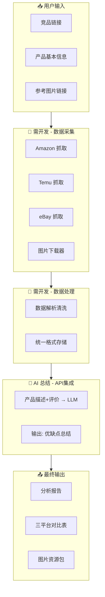

# 跨境电商竞品分析工作流 - 详细设计方案

## 一、需求概览

### 输入
1. **竞品链接** - Amazon/Temu/eBay 等平台的产品URL
2. **产品基本信息** - 产品名称、类目、ASIN/SKU等
3. **参考图片链接** - 需要下载的目标产品图片URL

### 输出
1. **Amazon产品深度分析** - 详细描述、优缺点总结
2. **三平台表现报告** - Amazon/Temu/eBay 的评价、评分、销量、上架时间
3. **图片资源包** - 主图、副图、详情图下载

---

## 二、技术实现分类

| 模块 | 实现方式 | 需要开发 | AI参与 | 难度 |
|------|----------|----------|--------|------|
| 数据采集 | API/爬虫 | ✅ 是 | ❌ 否 | 高 |
| 图片下载 | 爬虫/请求 | ✅ 是 | ❌ 否 | 中 |
| 数据解析 | 代码解析 | ✅ 是 | ❌ 否 | 中 |
| 文本总结 | LLM处理 | ✅ 轻量 | ✅ 是 | 低 |
| 报告生成 | 模板+AI | ✅ 是 | ✅ 是 | 低 |

---

## 三、详细流程图

```
┌─────────────────────────────────────────────────────────────────────────────────┐
│                          跨境电商竞品分析工作流                                     │
└─────────────────────────────────────────────────────────────────────────────────┘

                                    【用户输入】
                    ┌───────────────────────────────────────┐
                    │  ① 竞品链接 (URL)                       │
                    │  ② 产品基本信息 (名称/类目/ASIN)          │
                    │  ③ 参考图片链接                          │
                    └───────────────────┬───────────────────┘
                                        │
                                        ▼
┌─────────────────────────────────────────────────────────────────────────────────┐
│ 阶段一：数据采集 (需开发 - Python/Node.js)                                          │
├─────────────────────────────────────────────────────────────────────────────────┤
│                                                                                   │
│   ┌─────────────┐    ┌─────────────┐    ┌─────────────┐    ┌─────────────────┐ │
│   │  Amazon     │    │  Temu       │    │  eBay       │    │  图片下载模块     │ │
│   │  数据抓取   │    │  数据抓取   │    │  数据抓取   │    │  (主图/副图/详情) │ │
│   └──────┬──────┘    └──────┬──────┘    └──────┬──────┘    └────────┬────────┘ │
│          │                  │                  │                     │          │
│          │  • 产品描述       │  • 评价/评分     │  • 评价/评分        │  • 解析   │
│          │  • 评价/评分      │  • 销量(若有)    │  • 销量(若有)       │  • 下载   │
│          │  • 上架时间       │  • 上架时间      │  • 上架时间         │  • 存储   │
│          │  • 详情页HTML     │                  │                     │          │
│          │                  │                  │                     │          │
└──────────┼──────────────────┼──────────────────┼─────────────────────┼──────────┘
           │                  │                  │                     │
           └──────────────────┴────────┬─────────┴─────────────────────┘
                                       │
                                       ▼
                    ┌───────────────────────────────────────┐
                    │         原始数据存储 (JSON/DB)          │
                    └───────────────────┬───────────────────┘
                                        │
                                        ▼
┌─────────────────────────────────────────────────────────────────────────────────┐
│ 阶段二：数据清洗与解析 (需开发)                                                      │
├─────────────────────────────────────────────────────────────────────────────────┤
│  • HTML解析提取关键字段                                                            │
│  • 统一数据格式 (评分归一化、时间格式统一)                                           │
│  • 销量数据注意：Amazon/eBay/Temu 不公开真实销量，需使用估算或第三方数据源            │
└───────────────────────────────────────┬─────────────────────────────────────────┘
                                        │
                                        ▼
┌─────────────────────────────────────────────────────────────────────────────────┐
│ 阶段三：AI 智能分析 (API集成 - OpenAI/Claude/通义等)                                │
├─────────────────────────────────────────────────────────────────────────────────┤
│                                                                                   │
│   ┌─────────────────────────────────────────────────────────────────────────┐   │
│   │  Prompt输入：产品描述 + 评价摘要 + 基本信息                                │   │
│   └─────────────────────────────────────┬───────────────────────────────────┘   │
│                                         ▼                                       │
│   ┌─────────────────────────────────────────────────────────────────────────┐   │
│   │  AI 输出：                                                                │   │
│   │  • 产品优缺点总结 (结构化)                                                 │   │
│   │  • 竞品差异化分析                                                         │   │
│   │  • 改进建议 (可选)                                                        │   │
│   └─────────────────────────────────────────────────────────────────────────┘   │
│                                                                                   │
└───────────────────────────────────────┬─────────────────────────────────────────┘
                                        │
                                        ▼
┌─────────────────────────────────────────────────────────────────────────────────┐
│ 阶段四：报告生成 (模板 + 数据填充)                                                   │
├─────────────────────────────────────────────────────────────────────────────────┤
│  • 三平台对比表格 (评价/评分/上架时间)                                               │
│  • 优缺点总结文档                                                                   │
│  • 图片资源包 (按主图/副图/详情分类)                                                 │
│  • 输出格式：Markdown/PDF/Excel                                                    │
└───────────────────────────────────────┬─────────────────────────────────────────┘
                                        │
                                        ▼
                    ┌───────────────────────────────────────┐
                    │              【最终输出】               │
                    │  ① 分析报告 (含优缺点)                  │
                    │  ② 三平台表现对比表                     │
                    │  ③ 图片资源包 (本地文件夹)              │
                    └───────────────────────────────────────┘
```

---

## 四、各模块详细说明

### 4.1 数据采集（必须开发）

| 平台 | 推荐方案 | 说明 |
|------|----------|------|
| **Amazon** | • 爬虫 (Playwright/Puppeteer) <br>• 或 Rainforest API/Keeper 等第三方 | 官方API需申请，限制多。爬虫需处理反爬(验证码、IP封禁) |
| **Temu** | • 爬虫 (需处理动态加载) <br>• 或 数据服务商API | 页面动态加载多，需 Selenium/Playwright |
| **eBay** | • **eBay Finding API** (官方免费) <br>• **eBay Shopping API** | 推荐使用官方API，需注册开发者账号 |

**开发技术栈建议：**
- Python: `requests` + `BeautifulSoup` + `Playwright` + `httpx`
- 或 Node.js: `Puppeteer` + `cheerio`

### 4.2 图片下载（必须开发）

- 解析产品详情页HTML，提取图片URL
- 支持主图、副图、详情图(A+内容)的区分
- 批量下载并命名规范（如：`主图_01.jpg`, `副图_02.jpg`, `详情_03.jpg`）
- 注意：各平台图片可能有防盗链，需设置正确的 `Referer` 或 `User-Agent`

### 4.3 AI 总结（API集成即可）

- **输入**：产品描述文本 + 精选评价(取前50-100条)
- **输出**：结构化优缺点列表
- **推荐模型**：GPT-4/Claude/通义千问等
- **成本**：按Token计费，单次分析约 $0.01-0.05

**示例 Prompt：**
```
请根据以下亚马逊产品描述和评价，输出：
1. 产品核心卖点（3-5条）
2. 用户反馈的优点（3-5条）
3. 用户反馈的缺点/改进点（3-5条）
4. 一句话竞品定位总结

产品描述：[...]
评价摘要：[...]
```

### 4.4 销量数据特殊说明 ⚠️

| 平台 | 销量可见性 | 可行方案 |
|------|------------|----------|
| Amazon | 不公开真实销量 | BSR排名、第三方工具(Jungle Scout/Helium 10)估算 |
| Temu | 部分显示"已售XX" | 抓取页面显示数据 |
| eBay | 显示"已售出"数量 | 可抓取 |

---

## 五、实施路线图

```
第1周：环境搭建 + eBay API 集成 (有官方API，优先)
第2周：Amazon 数据采集 (爬虫或第三方API选型)
第3周：Temu 数据采集 + 图片下载模块
第4周：AI 接口集成 + 报告模板
第5周：整合测试 + 异常处理
```

---

## 六、技术架构建议

```
┌────────────────────────────────────────────────────────────┐
│                     Web界面 / 表单输入                        │
└─────────────────────────┬──────────────────────────────────┘
                          │
┌─────────────────────────▼──────────────────────────────────┐
│                   后端服务 (FastAPI/Express)                  │
│  • 任务队列 (Celery/Bull) - 异步执行                         │
│  • 数据存储 (Redis + PostgreSQL/MongoDB)                     │
└─────────────────────────┬──────────────────────────────────┘
                          │
         ┌────────────────┼────────────────┐
         ▼                ▼                ▼
┌─────────────┐  ┌─────────────┐  ┌─────────────────┐
│ 采集 Worker │  │ 图片 Worker │  │  AI 调用模块     │
└─────────────┘  └─────────────┘  └─────────────────┘
```

---

## 七、成本估算（参考）

| 项目 | 成本 |
|------|------|
| 代理IP (反爬) | $50-200/月 |
| AI API (GPT-4) | $0.01-0.05/次分析 |
| 第三方数据API (可选) | $50-500/月 |
| 服务器 | $20-100/月 |

---

## 八、快速启动建议

**MVP 最小可行方案：**
1. 先做 **单一平台 (Amazon)** 的完整闭环
2. 图片下载单独做一个脚本
3. AI 总结用现成的 ChatGPT API 或 通义千问
4. 输出用 **Markdown + 图片文件夹** 即可

后续再扩展到 Temu、eBay，并做 Web 界面。

---

---

## 九、Mermaid 流程图（可在 VS Code / GitHub 中渲染）


